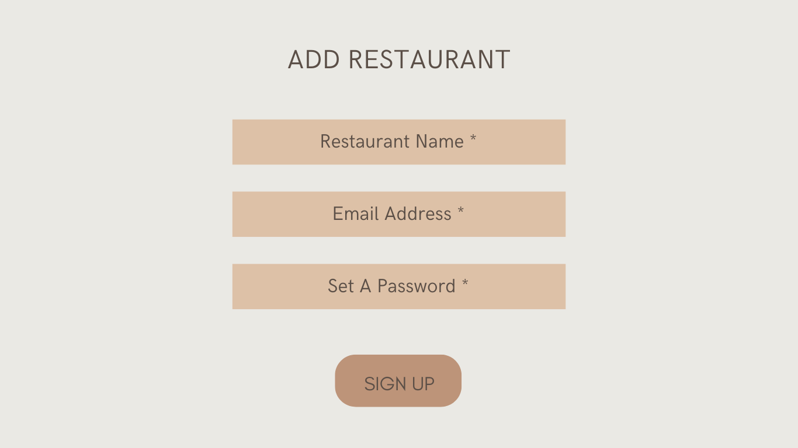
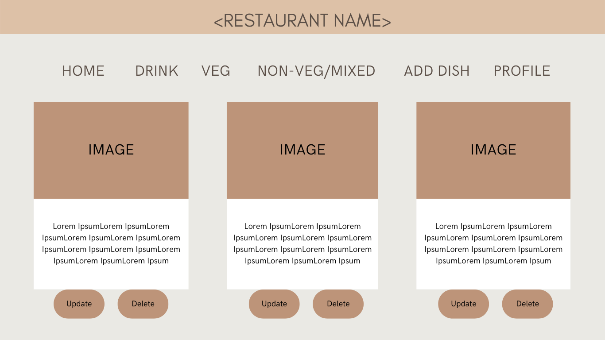

## Food Delivery Platform (Vendor Mangement)
* It is a web application. Where the user/owner can Register/Update their restaurants.
* The owner/user will be able to update or add one or more dishes under each restaurant.
* It will be a full-stack project.
* For project management and to maximize my efficiency. I will be using kanban board an agile project management tool.
*For the Mockup Design, I have used canva.

## My Mockup Design

* Login Page

* Home Page(Owner)

## Tools, Framework and Language
* I will be using HTML, CSS, JavaScript, React, and Bootstrap for Frontend.
* I will be using Java Programming Language &  Spring Boot for REST API.
* I will be using the JUnit to test my controller method.
* I will be using my postman to test my Rest API. Will be using Junit to create test.
* I will be using MYSQL Database.

## Connecting Frontend & Backend
* I will be Using Axios, a Javascript library, to communicate with the backend.
